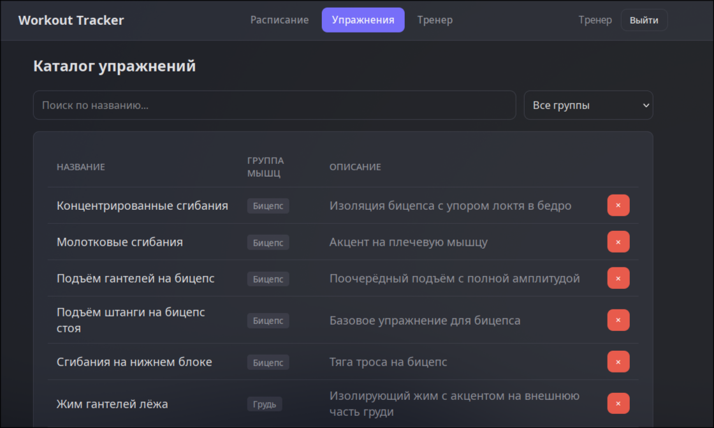
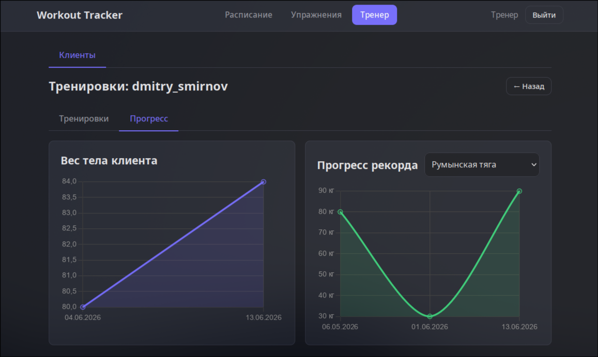
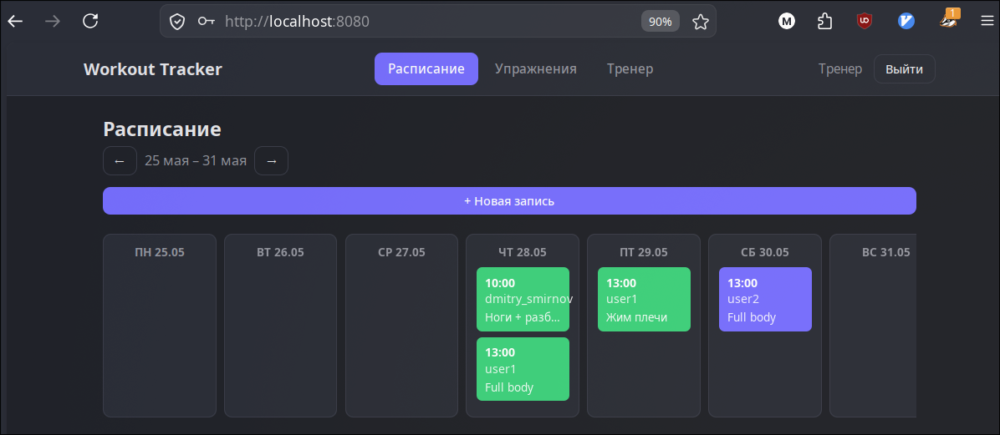
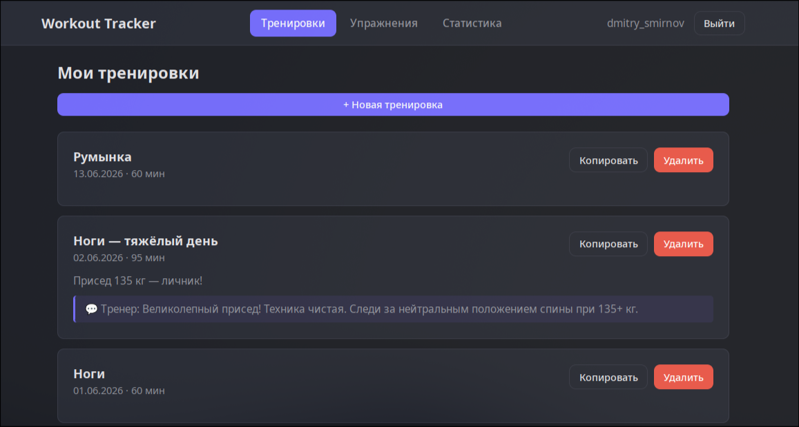
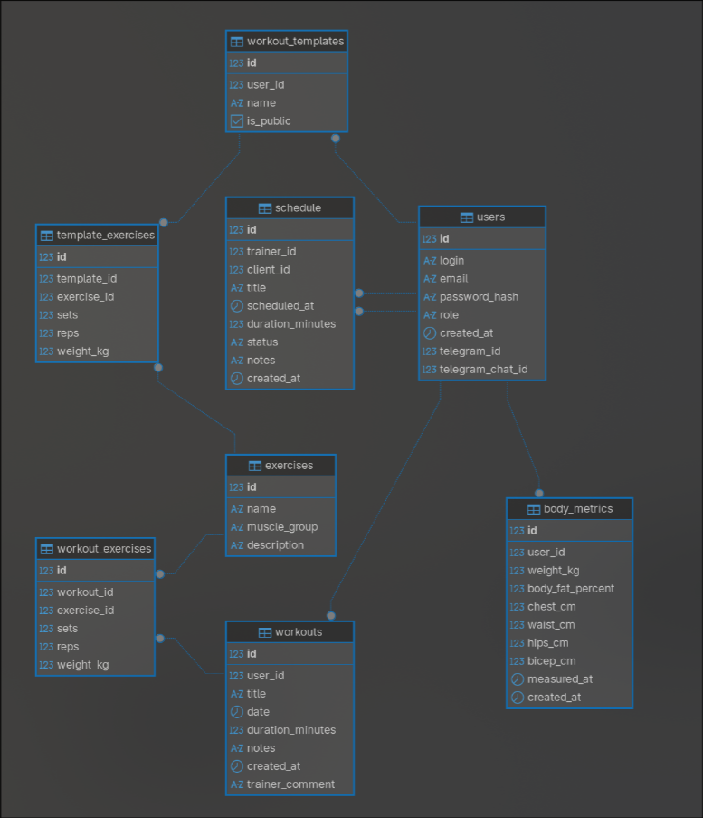

# 🏋️ Workout Tracker

**Трекер тренировок с панелью тренера, аналитикой прогресса и Swagger API**

[](https://golang.org/) [](https://postgresql.org/) [](https://docker.com/) [](file:///home/makar/Documents/YSTU/ProjectTrecerTrainingGO/LICENSE) [](http://localhost:8080/swagger/)


## Скриншоты

| Каталог упражнений | Статистика прогресса |
| :-: | :-: |
|  |  |


| Журнал тренировок | Детали тренировки |
| :-: | :-: |
|  |  |


## Технологии

| Категория | Стек |
| - | - |
| 🔧 **Backend** | Go 1.25 · [chi v5](https://github.com/go-chi/chi) · [pgx/v5](https://github.com/jackc/pgx) |
| 🗄️ **База данных** | PostgreSQL 16 |
| 🔐 **Аутентификация** | JWT HS256 · bcrypt |
| 🎨 **Фронтенд** | Vanilla JS · [Chart.js](https://chartjs.org/) (SPA) |
| 📖 **Документация** | Swagger UI ([swaggo](https://github.com/swaggo/swag)) |
| 🐳 **Контейнеризация** | Docker · Docker Compose |
| 🔄 **Миграции** | [golang-migrate](https://github.com/golang-migrate/migrate) |


## Архитектура

### HTTP-стек

```
  Клиент (Browser / REST)  
               │  
               ▼  
  ┌─────────────────────────────────┐  
  │          chi Router             │  
  │  rate limiter · logger · pprof  │  
  └──────────────┬──────────────────┘  
                 │  
                 │  AuthMiddleware  
                 │  JWT → user\_id + role → context  
                 ▼  
  ┌─────────────────────────────────┐  
  │            Handler              │  
  │  auth · exercise · workout      │  
  │  template · metrics · admin     │  
  └──────────────┬──────────────────┘  
                 │  
                 ▼  
  ┌─────────────────────────────────┐  
  │            Service              │  
  │  бизнес-логика; узкие           │  
  │  интерфейсы репозитория         │  
  └──────────────┬──────────────────┘  
                 │  
                 ▼  
  ┌─────────────────────────────────┐  
  │          Repository             │  
  │  pgx/v5 pool · транзакция       │  
  │  при создании тренировки        │  
  └──────────────┬──────────────────┘  
                 │  
                 ▼  
            PostgreSQL
```


## Возможности

### Для пользователя

| \# | Функция | Описание |
| - | - | - |
| 1 | 📋 **Журнал тренировок** | Создание, редактирование, удаление сессий с упражнениями (подходы × повторения × вес) |
| 2 | 🔁 **Копирование тренировок** | Мгновенное повторение прошлой сессии одним кликом |
| 3 | 📁 **Шаблоны** | Сохранение программ, мгновенный старт из шаблона |
| 4 | 🏆 **Личные рекорды (PR)** | Автоматическая фиксация максимального веса по каждому упражнению |
| 5 | 📊 **Аналитика** | Недельный объём по мышечным группам + прогресс веса на Chart.js |
| 6 | 📏 **Метрики тела** | Вес, % жира, замеры (грудь, талия, бёдра, бицеп) с историей |
| 7 | 🔐 **JWT-аутентификация** | Защищённые сессии с истечением срока действия |


### Для тренера (роль `admin`)

| \# | Функция | Описание |
| - | - | - |
| 1 | 👥 **Клиентская база** | Просмотр всех пользователей и их тренировок |
| 2 | ✍️ **Тренировки за клиента** | Создание программы от имени клиента |
| 3 | 💬 **Комментарии тренера** | Обратная связь к тренировке клиента |
| 4 | 📅 **Расписание** | Планирование сессий (`planned` / `completed` / `cancelled`) |
| 5 | 📈 **Прогресс клиента** | Метрики тела и прогресс по упражнениям любого клиента |
| 6 | 🔍 **Профилировщик** | `/debug/pprof/` — защищён JWT + AdminOnly |


## Схема базы данных




## Быстрый старт

### Требования

- [Docker](https://docs.docker.com/get-docker/) + Docker Compose v2

- [golang-migrate](https://github.com/golang-migrate/migrate/tree/master/cmd/migrate) — для локального запуска без Docker

### 1. Клонировать репозиторий

```
git clone https://github.com/churilovmn1/workout-tracker.git  
cd workout-tracker
```

### 2. Настроить окружение

```
cp .env.example .env
```

Откройте `.env` и задайте переменные (см. раздел [Переменные окружения](#️-переменные-окружения)).

### 3а. Запуск через Docker Compose *(рекомендуется)*

```
\# Поднимает PostgreSQL + приложение  
docker compose up -d  
  
\# Применить миграции  
docker compose run --rm migrate
```

Приложение доступно на **http://localhost:8080** 

### 3б. Локальный запуск (только зависимости в Docker)

```
\# Только PostgreSQL  
docker compose up -d db  
  
\# Применить миграции  
make migrate-up  
  
\# Запустить приложение  
make run
```

### 4. Открыть в браузере

| URL | Назначение |
| - | - |
| `http://localhost:8080` | 🌐 Web-интерфейс |
| `http://localhost:8080/swagger/` | 📖 Swagger UI |
| `http://localhost:8080/debug/pprof/` | 🔍 Профилировщик (только admin) |


## API Эндпоинты

Все `/api` маршруты (кроме `/auth/\*`) требуют заголовка:

```
Authorization: Bearer \<jwt-token\>
```

### Аутентификация

| Метод | Путь | Описание |
| - | - | - |
| `POST` | `/api/auth/register` | Регистрация нового пользователя |
| `POST` | `/api/auth/login` | Вход, получение JWT-токена |


### Упражнения

| Метод | Путь | Доступ | Описание |
| - | - | :-: | - |
| `GET` | `/api/exercises` | 👤 | Список упражнений (фильтр по мышечной группе) |
| `GET` | `/api/exercises/\{id\}` | 👤 | Упражнение по ID |
| `POST` | `/api/exercises` | 🎓 | Создать упражнение |
| `PUT` | `/api/exercises/\{id\}` | 🎓 | Обновить упражнение |
| `DELETE` | `/api/exercises/\{id\}` | 🎓 | Удалить упражнение |


### Тренировки

| Метод | Путь | Описание |
| - | - | - |
| `GET` | `/api/workouts` | Список тренировок текущего пользователя |
| `POST` | `/api/workouts` | Создать тренировку (с упражнениями) |
| `GET` | `/api/workouts/\{id\}` | Детали тренировки |
| `PUT` | `/api/workouts/\{id\}` | Обновить тренировку |
| `DELETE` | `/api/workouts/\{id\}` | Удалить тренировку |
| `POST` | `/api/workouts/\{id\}/copy` | Скопировать тренировку |


### Шаблоны

| Метод | Путь | Описание |
| - | - | - |
| `GET` | `/api/templates` | Список шаблонов |
| `POST` | `/api/templates` | Создать шаблон |
| `GET` | `/api/templates/\{id\}` | Детали шаблона |
| `PUT` | `/api/templates/\{id\}` | Обновить шаблон |
| `DELETE` | `/api/templates/\{id\}` | Удалить шаблон |
| `POST` | `/api/templates/\{id\}/start` | Начать тренировку из шаблона |


### Статистика

| Метод | Путь | Описание |
| - | - | - |
| `GET` | `/api/stats/pr` | Личные рекорды по упражнениям |
| `GET` | `/api/stats/volume` | Недельный объём по мышечным группам |
| `GET` | `/api/stats/exercise-progress` | Прогресс веса по упражнению |


### Метрики тела

| Метод | Путь | Описание |
| - | - | - |
| `GET` | `/api/metrics` | История замеров тела |
| `POST` | `/api/metrics` | Добавить замер |
| `DELETE` | `/api/metrics/\{id\}` | Удалить замер |


### Панель тренера

> Все маршруты `/api/admin/\*` доступны только роли `admin`.

| Метод | Путь | Описание |
| - | - | - |
| `GET` | `/api/admin/users` | Список всех пользователей |
| `GET` | `/api/admin/users/\{id\}/workouts` | Тренировки клиента |
| `POST` | `/api/admin/users/\{id\}/workouts` | Создать тренировку за клиента |
| `GET` | `/api/admin/users/\{id\}/metrics` | Метрики тела клиента |
| `GET` | `/api/admin/users/\{id\}/exercise-progress` | Прогресс клиента по упражнению |
| `PUT` | `/api/admin/workouts/\{id\}/comment` | Оставить комментарий тренера |
| `GET` | `/api/admin/schedule` | Расписание тренера на неделю |
| `POST` | `/api/admin/schedule` | Добавить сессию в расписание |
| `PUT` | `/api/admin/schedule/\{id\}` | Обновить статус / данные сессии |
| `DELETE` | `/api/admin/schedule/\{id\}` | Удалить сессию |


## Переменные окружения

| Переменная | Обязательна | По умолчанию | Описание |
| - | :-: | - | - |
| `DATABASE\_URL` | ✅ | — | DSN подключения к PostgreSQL |
| `JWT\_SECRET` | ❌ | `default-secret-change-me` | Секрет для подписи JWT-токенов |
| `PORT` | ❌ | `8080` | Порт HTTP-сервера |
| `TEST\_DATABASE\_URL` | ❌ | `DATABASE\_URL` | DSN для repository-бенчмарков |


